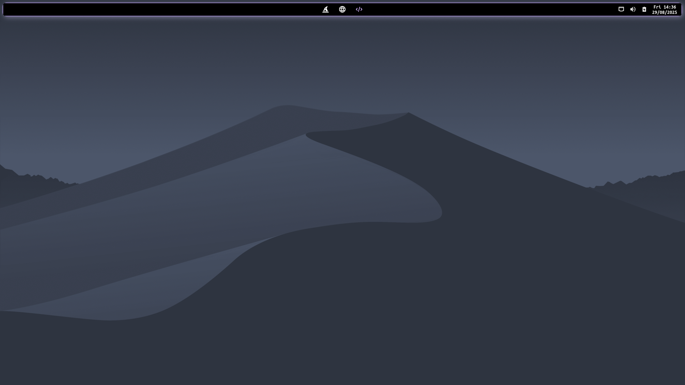
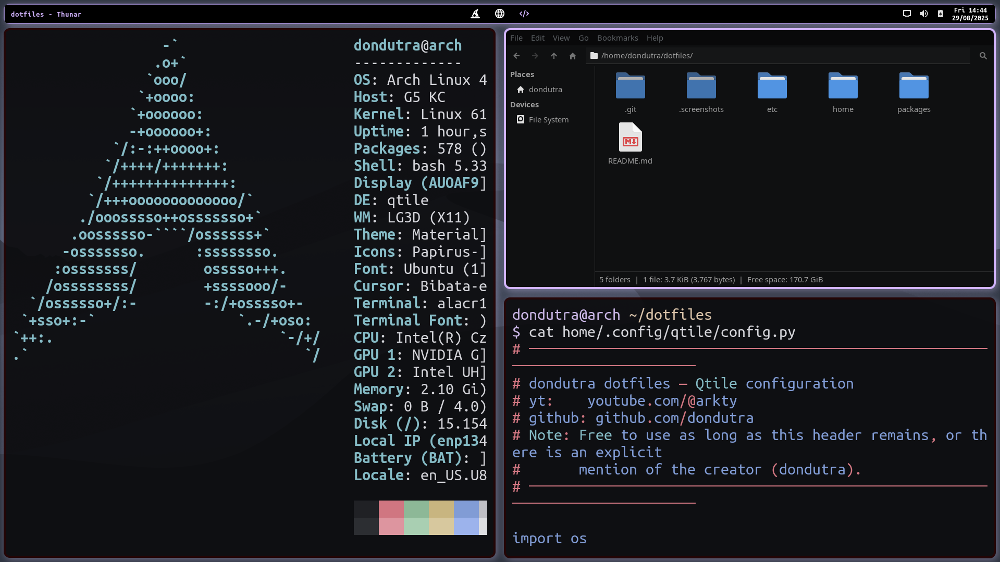
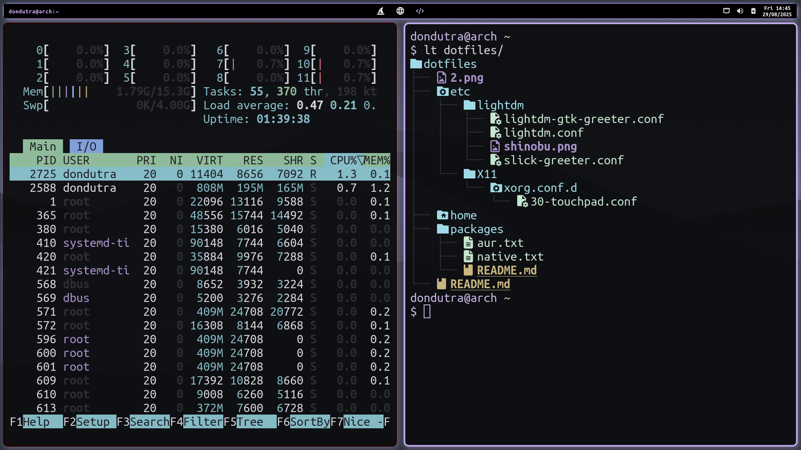
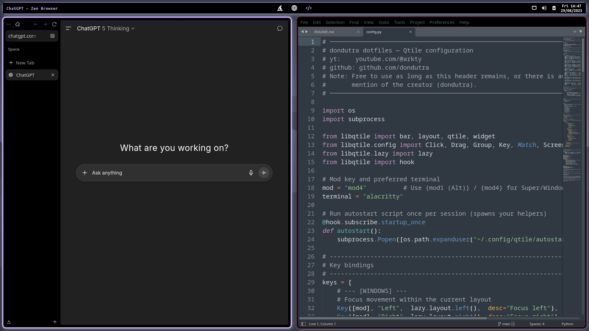

# 🧙‍♂️ Don Dutra Dotfiles

## Screenshot Galery
> See [`screenshots`](.screenshots/) for more screenshots!

<p align="center">
  
  
  
  
</p>

---

## Introduction

This repo shows **how to install & use my Arch setup** — it does **not** teach how to create or customize dotfiles from scratch.

The repository has two purposes:
1) **Personalization (visual setup).**  
2) **System functionality (audio, multi‑monitor helpers, mounts, etc.).**

Thereby, it may be seen as a whole personalized working Arch enviroment. Hence, I encourage you to check the packages you'll be installing so you can carefully add/remove exactly the ones you want.

---

## Preconditions

- A fresh **Arch Linux** installation. 
- Your user can run commands with **sudo**.  
- Internet access and basic shell usage.

Update your system:
```bash
sudo pacman -Syu
```

---

## Get the repository

> Install git if not already installed:
> ```bash
> sudo pacman -S --needed git
> ```

Pick a folder (I'll assume you put it in your home), then clone and enter the repo:

```bash
cd ~
git clone https://github.com/dondutra/dotfiles.git
cd dotfiles
```

You can delete this folder after finishing because configs are copied into your home.

---

## Install the packages

See [packages/README.md](packages/README.md) for installation steps covering both native Arch (pacman) and AUR packages.

## Enable system services

1) Enable LightDM:
   ```bash
   sudo systemctl enable lightdm.service
   sudo systemctl set-default graphical.target
   ```

2) Enable PipeWire:
   ```bash
   systemctl --user enable wireplumber.service
   ```

---

## Reboot & continue to lightdm

> Note: Rebooting here may save you from a lot of problems later.
```bash
reboot
```

Now the login manager (lightdm) should open. Enter your credentials. Default qtile session should start.

> Note: sometimes lightdm might use a different keyboard layout by default which leads to incorrect credentials by mistake. Double check the characters you are inputting!

---

## Place the dotfiles

> Note: default qtile keybinding for opening a terminal {super (windows) + enter}. Alternatively: {ctrl + alt + F2}
```bash
# Sync the dotfiles
rsync -avh ~/dotfiles/home/ ~/

# Ensure autostart script is executable (Qtile may call it)
chmod +x ~/.config/qtile/autostart.sh
```

---

## Copy system configs (/etc)
```bash
sudo rsync -avh ~/dotfiles/etc/ /etc/
```
This copies the entire `etc` directory from the repo into `/etc`. It only adds/overwrites files, it does not delete existing files there.

---

## Reboot
```bash
reboot
```

**Everything should be working as expected now. If everything is fine you may leave the guide here and optionally cleanup as seen next.**

---

## Cleanup (optional)

Once you confirm everything works, you can remove the cloned repository:

```bash
cd ~
rm -rf ~/dotfiles
```

---

**Now installation is fully complete.** Below we'll cover some useful tips you may want to know in order to use my personalized enviroment correctly.

---

## Entering QTile without a display manager (use **startx**)

Sometimes, lightdm is the only problem and qtile is fine. If you don't need a graphical login but you want everything else you may want to proceed as follows:
```bash
startx
```

> Note: The `startx` command relies on `.xinitrc` located in ~/.

> If `startx` says **command not found**, install `xorg-xinit`:
> ```bash
> sudo pacman -S xorg-xinit
> ```

---

## QTile Keybindings

Table with my qtile keybindings. You may change them as you like in the [qtile config file](home/.config/qtile/config.py).

| Keybinding            | Description             |
|:----------------------|:------------------------|
| mod+Left              | Focus left              |
| mod+Right             | Focus right             |
| mod+Down              | Focus down              |
| mod+Up                | Focus up                |
| mod+space             | Focus next window       |
| mod+shift+Left        | Move window left        |
| mod+shift+Right       | Move window right       |
| mod+shift+Down        | Move window down        |
| mod+shift+Up          | Move window up          |
| mod+control+Left      | Grow to the left        |
| mod+control+Right     | Grow to the right       |
| mod+control+Down      | Grow down               |
| mod+control+Up        | Grow up                 |
| mod+n                 | Reset window sizes      |
| mod+Tab               | Cycle layouts           |
| mod+w                 | Close focused window    |
| mod+f                 | Toggle fullscreen       |
| mod+t                 | Toggle floating         |
| mod+Return            | Launch terminal         |
| mod+m                 | App launcher (rofi)     |
| mod+b                 | Default browser         |
| mod+e                 | File manager            |
| mod+s                 | Snipping Tool Clipboard |
| mod+shift+s           | Snipping Tool General   |
| XF86AudioLowerVolume  | Decrease volume         |
| XF86AudioRaiseVolume  | Increase volume         |
| XF86AudioMute         | Mute audio              |
| XF86MonBrightnessUp   | Increase brightness     |
| XF86MonBrightnessDown | Decrease brightness     |
| mod+control+r         | Restart Qtile           |
| mod+control+q         | Shutdown Qtile          |
| mod+r                 | Command prompt          |
| mod+l                 | Lock session            |

---

## License

Distributed under the MIT License. See [LICENSE](./LICENSE) for more information.